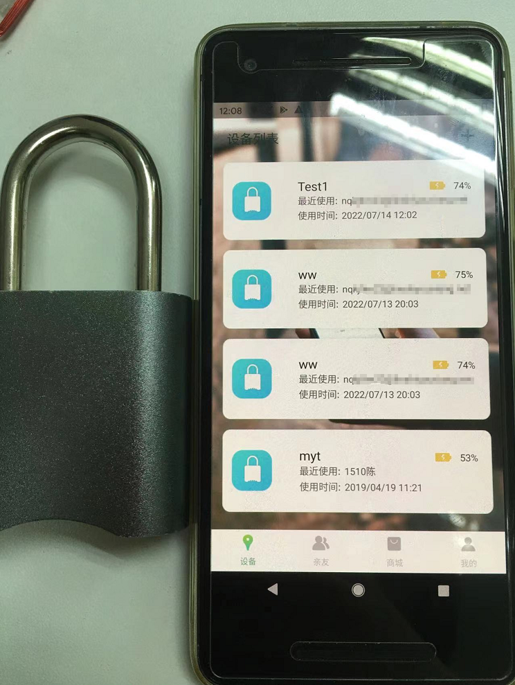

# Nokelock

## Vulnerability description

Smart padlock O1 is a smart lock of nokelock company. By sending a request, you can add any device and set the device password in the nokelock app.

## Scope of influence

### Device lock

All equipment locks

### Software

Nokelock 5.3.0

## Vulnerability analysis

When using Bluetooth to add smart lock devices in the nokelock app, you can capture packets and change the MAC address to communicate with other devices.

Requests /nokelock_v3/lock/bind, bind the userid to the device with the corresponding MAC address, and rename it

You can see the barcode of the device and various information in the response package

